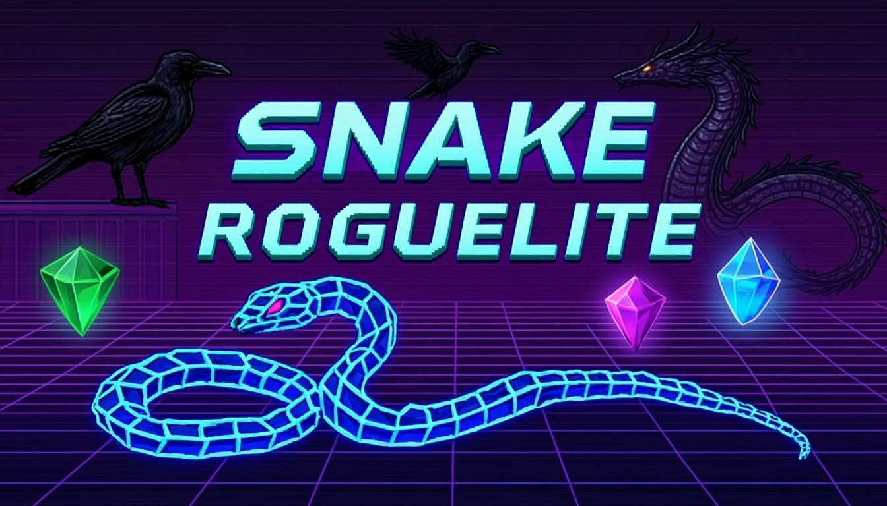

# 🐍 Snake Roguelite v1.9.4

<p align="center">
  
</p>

Un gioco Snake con meccaniche roguelite, creato con l'aiuto dell'intelligenza artificiale.


## 🎮 Gioca Subito

**Nessuna installazione necessaria!** Clicca sul link qui sotto e gioca direttamente dal browser:

👉 **[Gioca a Snake Roguelite](https://TUOUTENTE.github.io/SnakeRoguelite/)**

*(sostituisci `TUOUTENTE` con il tuo username GitHub)*

## 🕹️ Controlli

| Azione | Tastiera | Touch | Gamepad |
|--------|----------|-------|---------|
| Muoversi | Frecce / WASD | Swipe | D-Pad / Levetta |
| Pausa | Spazio / Escape | Doppio tap | Start |
| Kunai | K | - | - |
| Frammento del Vuoto | Spazio | - | - |

## 🌍 Zone

Il gioco è diviso in **7 zone** progressive, ognuna con il suo boss:

| # | Zona | Boss | Dimensione |
|---|------|------|------------|
| 1 | L'Albero di Mele | Il Corvo Gigante 🦅 | 15×15 |
| 2 | Il Bosco Oscuro | Il Lupo Ombra 🐺 | 20×20 |
| 3 | La Palude | Il Rospo Re 🐸 | 23×23 |
| 4 | Il Regno d'Oro | Il Re Tiranno 👑 | 25×25 |
| 5 | Il Nido del Drago | La Draga Infernale 🐉 | 27×27 |
| 6 | Le Rovine Cosmiche | Il Guardiano del Vuoto 🔮 | 29×29 |
| 7 | Il Vuoto Abyssale | Il Serpente Primordiale 🐍 | 30×30 |

## ⚔️ Reliquie

Ogni livello ti offre la scelta tra **3 reliquie casuali**, divise per rarità:

- 🟢 **Comune** — Effetti base come scudi, velocità, punti bonus
- 🔵 **Raro** — Abilità speciali come inversione controlli (x2 punti!), attrazione frutti, rigenerazione coda
- 🟣 **Epico** — Poteri devastanti: distruzione muri, disintegrazione nemici, onde solari
- 🟡 **Leggendaria** — Abilità uniche: attraversamento bordi, teletrasporto, invincibilità temporanea
- 🔴 **Mitico** — Il potere assoluto: +3 vite, doppia XP, velocità estrema

Le reliquie dei **boss** si sbloccano dopo aver sconfitto il rispettivo boss in una run precedente!

## 🎵 Colonna Sonora

Il gioco include una colonna sonora originale con tracce uniche per ogni zona:

- Menu Theme
- Zone 0–6 (una per ogni zona)
- Pause Screen

## 📂 Struttura del Progetto

```
SnakeRoguelite/
├── index.html              # Pagina principale
├── style.css               # Stili e animazioni
├── core/
│   ├── game-loop.js        # Loop principale di gioco
│   ├── zones.js            # Logica delle zone
│   ├── state.js            # Stato globale
│   └── save.js             # Sistema di salvataggio
├── entities/
│   ├── enemies.js          # Logica dei nemici
│   └── boss-logic.js       # Intelligenza dei boss
├── render/
│   ├── draw.js             # Rendering su canvas
│   ├── hud.js              # Interfaccia di gioco
│   └── theme.js            # Temi visivi
├── data/
│   ├── constants.js        # Costanti e utility
│   ├── relics.js           # Database reliquie
│   ├── bosses.js           # Database boss
│   ├── zones.js            # Configurazione zone
│   ├── codex-db.js         # Database codex
│   └── secrets.js          # Segreti e Easter egg
├── systems/
│   ├── codex.js            # Sistema codex
│   ├── shop.js             # Sistema negozio
│   └── debug.js            # Strumenti di debug
├── input/
│   ├── keyboard.js         # Input da tastiera
│   ├── touch.js            # Input touch
│   └── gamepad.js          # Input gamepad
├── audio/
│   ├── music.js            # Gestione musica
│   └── sfx.js              # Effetti sonori
├── ui/
│   ├── dom-init.js         # Inizializzazione DOM
│   └── fx-bridge.js        # Effetti visivi
└── osts/
    └── zones/              # Tracce audio OGG
        ├── menu.ogg
        ├── pause.ogg
        ├── zone0.ogg
        ├── zone1.ogg
        ├── zone2.ogg
        ├── zone3.ogg
        ├── zone4.ogg
        ├── zone5.ogg
        └── zone6.ogg
```

## 🚀 Come Eseguire Localmente

1. Clona il repository:
   ```bash
   git clone https://github.com/TUOUTENTE/SnakeRoguelite.git
   cd SnakeRoguelite
   ```

2. Apri `index.html` nel tuo browser — nessun server richiesto!

   Oppure, se preferisci un server locale:
   ```bash
   # Con Python
   python3 -m http.server 8000

   # Con Node.js
   npx serve .
   ```

3. Vai su `http://localhost:8000` e gioca!

## 🛠️ Tecnologie

- **HTML5 Canvas** — Rendering del gioco
- **JavaScript Vanilla** — Nessuna dipendenza esterna
- **CSS3** — Interfaccia e animazioni
- **Web Audio API** — Audio e musica
- **Google Fonts** — Chakra Petch + Space Grotesk

## 📜 Licenza

Questo progetto è distribuito sotto licenza MIT. Vedi il file [LICENSE](LICENSE) per i dettagli.

---

*Creato con l'aiuto dell'intelligenza artificiale* 🤖
